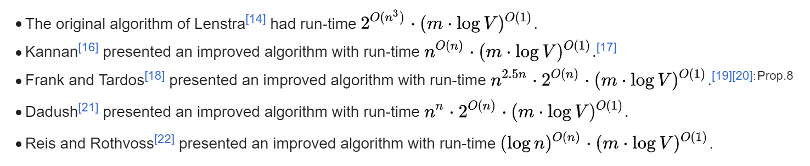

# Orchestrator

Optimal Distributed Computing Schedules using Integer Programming.

## What

The goal of orchestrator is to take a set of functions with
dependencies and outputs, and to distribute them across a cluster
in the most optimal way.

## How

We can use linear programming and existing solvers to find the best
solution given a set of constraints (memory, threadcount, latency, execution time, etc.).
See the basic formulas [here](docs/Linear%20Constraints%20Formulation.pdf).
Unfortunately linear programs have a really high time
complexity: 
So through variable reduction and incremental solving we can cache prior solutions
and use them to solve real-time problems efficiently.

JAX-Conductor
---
I noticed papers such as
Mamba ([Gu. A, & Dao T. (2023)](https://arxiv.org/abs/2312.00752)),
Flash Attention 2 ([Dao T. (2023)](https://arxiv.org/abs/2307.08691)),
and Ring Attention ([Liu, H., Zaharia, M., & Abbeel, P. (2023)](https://arxiv.org/abs/2310.01889))
that the optimizations and methods for distributing computation often boiled down to
the same kinds of transformations of the original code.

- Recurrence to convolution for parallelism (Mamba)
- Chunking for io-awareness and distribution (Ring Attn & Flash Attn)
- Kernel fusion for reduced intermediate state (Mamba & Flash Attn)

Knowing what technique to apply when seems like an easy algorithm:

- In the recurrence case, is it faster throughput-wise to perform the recurrence sequentially
  or recompute the recurrence for every token separately?
    - In cases where the GPU memory can't simply hold more batches, it's better to use a convolution even if there is
      many redundant computations
- For Kernel-fusion does the next step reduce dimensionality, and is the reduction in size worth any redundant
  operations?
- And chunking is a matter of what dimensions should I chunk along and by how much?

JAX-Conductor will work in conjunction with orchestrator to determine which devices should do what, when in what order.
Since each TPU or GPU-core-sram-pair can be thought of as its own device, and moving memory between them involves
complex coordination.

It will be a submodule of orchestrator that introduces a jaxpr interpretter
that automatically distributes any function across a cluster and across devices
and blocks using pallas. The goal will be to make it as simple
and modular as possible with integrated escape hatches in cases where the automated
process fails. (eg. precision issues with flash-attn)

A milestone would be to write a traditional transformer or vanilla mamba model and have JAX-Conductor
automatically implement optimizations such as Ring Attention, while also recognizing what part
of the sequence should go to what devices to minimize latency. (Eg. store the sequence in a ring order so the latency is
minimized)

